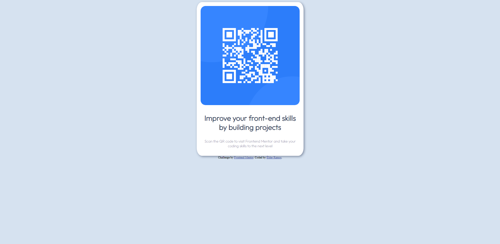
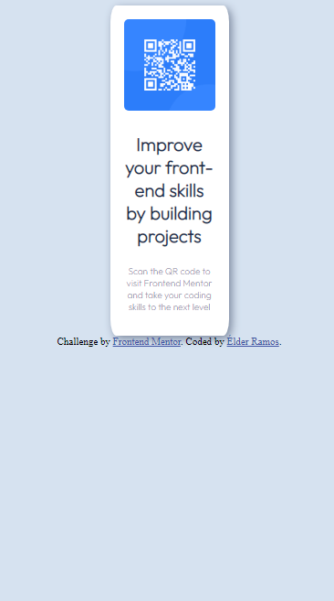

# Frontend Mentor - QR code component solution

This is a solution to the [QR code component challenge on Frontend Mentor](https://www.frontendmentor.io/challenges/qr-code-component-iux_sIO_H). Frontend Mentor challenges help you improve your coding skills by building realistic projects. 

## Table of contents

  - [Screenshot](#screenshot)
  - [Built with](#built-with)
  - [What I learned](#what-i-learned)
- [Author](#author)

### Screenshot

Desktop

Mobile

### Built with

- Semantic HTML5 markup
- CSS custom properties

### What I learned

Building this site i've learned how to center a div (classic) and to replicate a website.

## Author

- LinkedIn - [Élder Ramos](https://www.linkedin.com/in/elder-ramos-5738b41b7/)
- Frontend Mentor - [@elder-ramos](https://www.frontendmentor.io/profile/elder-ramos)
